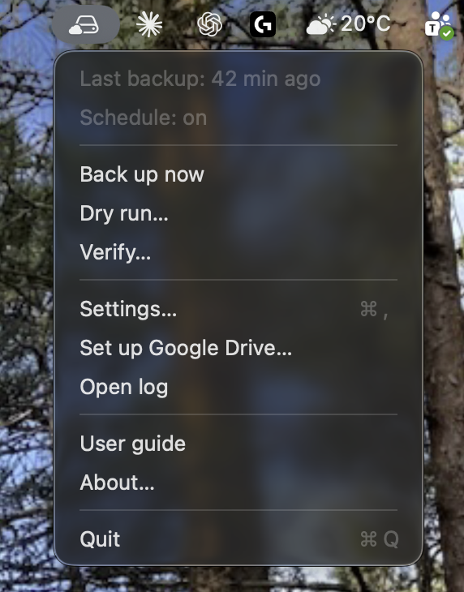
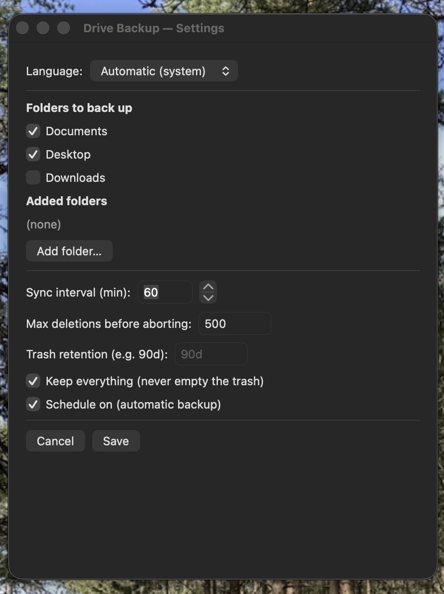

# iCloudtoGoogleDrive

**Software for Apple macOS** that mirrors your Mac's files — including everything
synced down from iCloud — to **Google Drive**, and keeps them in sync. A native
**menu-bar app** handles setup and monitoring; a tested shell engine (rclone +
launchd) does the actual work.

### Why you might want this

- **Moving from Apple to Android?** This is a clean way to take your files with
  you. Leave the service running on your Mac and your `~/Documents` (plus any
  folders you choose) keep flowing into Google Drive, where Android and Google's
  apps can reach them.
- **Or just leave it running for good.** If you have a Mac that's usually on — or
  you simply don't have that many files — keep this enabled and your documents
  are continuously backed up to Google, automatically.

> **iCloud:** this tool backs up the files that are actually **on the Mac's
> disk**, which includes iCloud content once it has been downloaded locally. It
> assumes your iCloud files are synced down to the computer, not left as
> online-only placeholders — see [iCloud notes](#icloud-notes).

The sync is **one-way** (Mac → Google Drive) and the interface is bilingual
(**English / Estonian**, switchable in Settings).

> **About the name:** the engine file is `icloud-gdrive-sync.sh` for historical
> reasons — the project started as an iCloud mirror. In practice it backs up the
> folders present on disk; iCloud Drive itself is never written to.

---

## Screenshots

| Menu bar | Settings |
|:--------:|:--------:|
|  |  |

The menu-bar drop-down (last-backup age, schedule state, and the actions) and the
Settings window (folders, language, sync interval, retention). Shown here in
English — switch to Estonian in **Settings → Language**.

---

## Safety model (the whole point)

**Your local files can never be deleted by this tool.** `rclone sync SRC DEST`
reads `SRC` and only ever writes/deletes on `DEST`. Every deleting command in the
engine targets the `gdrive:` remote — there is no `rm` and no local-path delete.
So `~/Documents` / `~/Desktop` (and iCloud) are read-only to this tool.

Even on the Google Drive side, nothing is lost abruptly:

- Deleted/overwritten files are diverted to `gdrive:Mac-Backup-Trash/<date>/…`
  (recoverable ~90 days, then ~30 more in Drive's own trash). The retention period
  is configurable (Settings → *Trash retention*), including **keep everything
  forever** (`RETENTION=never`) so nothing is ever purged.
- **Mass-delete circuit breaker:** before each sync, a no-op `--dry-run` counts
  how many files *would* be deleted; if that exceeds `MAX_DELETE` (default 500)
  the real sync is refused entirely — a corrupted/half-mounted source can't
  silently gut the backup.

These properties are covered by the test suite (`./test.sh`, 75 assertions,
including "source is byte-identical before/after a sync").

---

## Requirements

- macOS 13+ (built/tested on macOS 26)
- [rclone](https://rclone.org): `brew install rclone` — required at runtime
- Xcode **Command Line Tools** (`xcode-select --install`) — only needed to
  **build from source**; not needed to run the ready-made `.dmg`

---

## Install

### Option A — download the app (`.dmg`)

Grab **Drive-Backup.dmg** from the [Releases](https://github.com/raulo987/iCloudtoGoogleDrive/releases)
page, open it, and drag **Drive Backup.app** onto **Applications**. The app is
self-contained (the backup engine is bundled inside it).

- **First launch only:** right-click the app → **Open** → **Open**. It is safe
  but unsigned (no paid Apple Developer ID), so macOS asks once. If it's ever
  blocked as "damaged": `xattr -dr com.apple.quarantine "/Applications/Drive Backup.app"`.
- Install rclone if you haven't: `brew install rclone`.

### Option B — build from source

```sh
git clone <this-repo> iCloudtoGoogleDrive
cd iCloudtoGoogleDrive
./install.sh          # builds the app to ~/Applications and the CLI engine to ~/bin
```

To produce a shareable disk image yourself: `./make-dmg.sh` → `dist/Drive-Backup.dmg`.

The app is menu-bar-only (no Dock icon). Then, from the menu-bar icon (menu labels
appear in your chosen language):

1. **Set up Google Drive…** — one-time OAuth in Terminal (delegated to
   `rclone`; the GUI never sees tokens). It offers to use **your own Google
   `client_id`** — recommended, because rclone's shared one is being retired
   during 2026 (see [Reliability](#reliability--hardening)).
2. **Settings…** — pick folders, sync interval, `MAX_DELETE`, retention, the
   interface language, and the optional hardening toggles (thorough checksum
   compare, weekly integrity check, bandwidth limit); enable the schedule.
3. **Back up now** — first full upload.

Start the GUI at login (optional):

```sh
launchctl bootstrap gui/$(id -u) ~/Library/LaunchAgents/eu.itteam.gdrive-backup-gui.plist
```

---

## Usage

**GUI menu:** last-backup age · schedule state · Back up now · Dry run · Verify ·
Settings · Set up Google Drive · Open log · **User guide** · **About** · Quit.
The interface is available in **English and Estonian** — switch it in
**Settings → Language** (defaults to your macOS system language).

The **User guide** opens an in-app help window; **About** shows the developer and
project links. Output from Dry run / Verify opens in a large, resizable,
scrollable window.

**CLI** (same engine):

```sh
~/bin/icloud-gdrive-sync.sh            # run a backup
~/bin/icloud-gdrive-sync.sh --dry-run  # preview; transfer nothing
~/bin/icloud-gdrive-sync.sh --verify   # checksum-compare source vs backup
~/bin/icloud-gdrive-sync.sh --status   # when the last backup succeeded
```

---

## How it works

```
Menu-bar app (Swift/AppKit)  --reads/writes-->  ~/.config/gdrive-backup/
   |  runs (Process)                              gui.json  (GUI state, JSON)
   v                                              config    (generated shell KEY=value)
icloud-gdrive-sync.sh  <-- launchd (schedule) <-- eu.itteam.gdrive-sync.plist
   |  (OAuth delegated to rclone config)
   v
rclone  -->  Google Drive
```

The GUI owns `gui.json` and **generates** the shell `config` the engine
`source`s (values are shell-escaped, so folder names can contain spaces, `$`,
quotes, etc. without injection). Don't hand-edit the generated `config`.

Configuration precedence: **config file > environment > built-in default.**
`SOURCES` entries are plain names (under `$HOME`) or absolute paths (backed up
under their basename; two sources may not share a basename).

**Excluded from backups:** `.DS_Store`, `node_modules`, `.venv`/`venv`,
`__pycache__`, `*.pyc`, `.Trash`, `*.icloud`, and transient/lock files
(`*.sqlite-wal`/`-shm`/`-journal`, `*-wal`/`*-shm`, MS Office `~$…` and
LibreOffice `.~lock…#` locks). `.git` history **is** kept. Symlinks are preserved
(as `.rclonelink` on Drive), not followed.

**One run at a time, self-healing.** Only one backup runs at a time (an atomic
`mkdir` lock). If a scheduled run fires while a previous one is still going —
common during a large first upload — the new one logs `SKIP: another backup is
already running` and steps aside. **That message is normal, not an error.** A
lock left behind by a crash, a kill, or a recycled process id is detected and
reclaimed automatically: the engine checks that the recorded pid is really a
running copy of itself, so a stale lock can never freeze future backups and you
never need to delete it by hand.

---

## Reliability & hardening

Informed by the failure modes documented in the storage/backup literature
(silent corruption, unreliable cloud modtimes, rate limits, restore-testing
gaps), the tool includes:

- **Bring-your-own Google `client_id`.** The setup step can store your own free
  OAuth client. rclone's *shared* client_id is being **retired during 2026** and
  is heavily rate-limited; your own avoids both. Guide:
  <https://rclone.org/drive/#making-your-own-client-id>.
- **Scheduled integrity check** (Settings → *Weekly integrity check*). A separate
  launchd agent runs `--verify` (a checksum `rclone check`) on its own interval
  and notifies you on any mismatch — catching at-rest bit rot or a corrupt source
  that a normal run won't. A one-off restore test is still worth doing by hand:
  `rclone copy gdrive:Mac-Backup/Documents ~/restore-test -P`.
- **Thorough compare** (Settings → *Thorough compare (checksums)*, or `CHECKSUM=1`).
  Compares by checksum instead of size+modtime — Google Drive's stored modtime is
  unreliable, so a changed file can otherwise be silently skipped.
- **Bandwidth / API-rate limits** — `BWLIMIT` (Settings) and `TPSLIMIT` (config)
  map to rclone's `--bwlimit` / `--tpslimit` to avoid throttling on large or
  metered transfers.
- **Sync-plan logging** — each run logs `plan: ~N to upload/update, ~M to delete`
  before applying, so a surprising change is visible in the log.

**Known limitations (by design):**

- **macOS metadata is not preserved** to Drive — extended attributes, Finder
  tags/comments, resource forks, custom icons, and POSIX permissions are dropped
  (rclone copies file **content + name + mtime** only). A restore is byte-accurate
  but "just the bytes." Time Machine covers metadata.
- **No source snapshot.** A file (or a live database / Photos library) written
  *during* a run can be captured inconsistently. rclone flags a single file that
  changes mid-copy, but there is no cross-file point-in-time snapshot. Quit apps
  that hold big live databases before a large backup, or exclude those folders.
- **No encryption at rest and no second, immutable copy.** These are deliberately
  *not* bundled: `rclone crypt` would change the on-Drive format and require a
  one-time re-upload, and a lost passphrase means permanent data loss; an
  append-only second copy (e.g. `restic`/Borg) is a separate backend. Both are
  reasonable next steps if you want them — open an issue.

---

## Troubleshooting

- **`FAIL: … is missing or empty` on scheduled runs, but "Back up now" works.**
  This is almost always **Full Disk Access**. A background launchd run without it
  reads a protected `~/Documents` / `~/Desktop` as *empty*, and the tool refuses
  (an empty source would gut the backup). Fix: **System Settings → Privacy &
  Security → Full Disk Access**, and add **Drive Backup** and **`/bin/bash`**
  (the scheduled agent runs `/bin/bash`). The engine now says *"cannot read …
  (permission denied). Grant Full Disk Access"* instead of the misleading
  "empty". One failing folder no longer blocks the others — the healthy sources
  still back up, and the run just exits non-zero.
- **`--verify` reports differences.** Verify compares the backup against the
  **current** local files, so anything that changed *since the last successful
  backup* shows up — recent screenshots, a `.git/index` touched by any git
  command, etc. This is expected drift, not corruption. If you see *many*
  differences, the real cause is usually that backups have been failing (see Full
  Disk Access above), so the backup went stale — fix that, run **Back up now**,
  then re-verify.
- **`NOTICE: … shared … client_id … retired … 2026`.** Switch to your own client
  (**Set up Google Drive…** → *yes* to your own `client_id`). See
  [Reliability](#reliability--hardening).

---

## Testing

```sh
./test.sh                                   # engine: 75 assertions in a sandbox
"$HOME/Applications/Drive Backup.app/Contents/MacOS/Drive Backup" --selftest
```

`test.sh` runs the real engine against a throwaway local directory (no Google
Drive, no real data). `--selftest` verifies shell-config generation, escaping,
and injection-safety headlessly.

---

## iCloud notes

- **iCloud ≠ backup.** iCloud is *sync*: deleting on one device deletes
  everywhere. This mirror (and Time Machine) are the actual backups.
- This tool backs up **local** folders only. Content that lives *only* in iCloud
  (Photos, other devices' iCloud Drive, Notes/Messages) is **not** covered — make
  sure the files you care about are downloaded to this Mac first.
- **Turn off "Optimise Mac Storage" first.** On the Mac, set **System Settings →
  Apple Account → iCloud → "Optimise Mac Storage" = OFF** — otherwise iCloud
  evicts files to 0-byte `*.icloud` placeholders and they are *not really on
  disk*, so they can't be backed up. The engine **detects placeholders before
  each sync, reports how many, and refuses** that folder (rather than storing
  empty stubs) — download them first (`brctl download <folder>`) or turn the
  setting off.
- **Not backed up** (rclone copies file content + name + mtime only): Finder
  tags, extended attributes, resource forks, custom icons. Time Machine covers
  those.
- Estonian/Unicode filenames (õ ä ö ü š ž), spaces, symbols and long names
  round-trip correctly (tested).

## Google Drive notes

- The rclone shared OAuth client is rate-limited; a large first upload may hit
  429/403 and slow down (rclone retries). For heavy use, create your own Google
  API `client_id`/`secret` and add it to the remote.
- Google Drive allows 750 GB/day of uploads; add `--drive-stop-on-upload-limit`
  if you back up very large sets.
- Trash counts toward quota for ~30 days; fine on a 2 TB plan.
- If the OAuth token is revoked (password change, long inactivity), backups fail
  (you get a notification) — re-run "Set up Google Drive…" → reconnect.

---

## Restore

```sh
rclone copy gdrive:Mac-Backup/Documents "$HOME/Documents-restored" -P   # whole folder
rclone lsf gdrive:Mac-Backup-Trash/                                     # browse trash
```

Always restore with `copy` into a **local** destination — never
`rclone sync gdrive:… ~/Documents`.

---

## Uninstall

```sh
launchctl bootout gui/$(id -u)/eu.itteam.gdrive-sync 2>/dev/null
launchctl bootout gui/$(id -u)/eu.itteam.gdrive-verify 2>/dev/null
launchctl bootout gui/$(id -u)/eu.itteam.gdrive-backup-gui 2>/dev/null
rm -rf "$HOME/Applications/Drive Backup.app"
rm -f  "$HOME/bin/icloud-gdrive-sync.sh" "$HOME/bin/rclone-setup.command"
rm -f  "$HOME/Library/LaunchAgents/eu.itteam.gdrive-sync.plist" \
       "$HOME/Library/LaunchAgents/eu.itteam.gdrive-verify.plist" \
       "$HOME/Library/LaunchAgents/eu.itteam.gdrive-backup-gui.plist"
# Google Drive data and ~/.config/gdrive-backup are left intact.
```

---

## Disclaimer

**Use at your own risk.** This software is provided "as is", without warranty of
any kind (see [LICENSE](LICENSE)). It assumes you know what you are doing:
**test it yourself first** — do a dry run, run a real backup on a non-critical
folder, and confirm you can restore from Google Drive — **before** relying on it.
The authors accept no liability for data loss. A backup you have never restored
from is not yet a backup.

---

## Contributing

**Contributors welcome — come build it further!** This began as a personal tool,
but it's meant to grow, and I'd love help from people who want to take it further.
Bug reports, feature ideas, translations, and pull requests are all appreciated.

- Found a bug or have an idea? Open an
  [issue](https://github.com/raulo987/iCloudtoGoogleDrive/issues).
- Want to change something? Fork, branch, and send a pull request — please run
  `./test.sh` and `--selftest` first, and keep the safety invariants intact
  (the tool must never be able to delete local files).
- Not sure where to start? The engine is `bin/icloud-gdrive-sync.sh`, the
  menu-bar app is `gui/*.swift`, and both are covered by `test.sh`.

Questions or want to collaborate? Reach out: [raul@orav.me](mailto:raul@orav.me) ·
[itteam.eu](https://itteam.eu).

---

## Author

**Raul Orav** · email: [raul@orav.me](mailto:raul@orav.me) · GitHub:
[github.com/raulo987/iCloudtoGoogleDrive](https://github.com/raulo987/iCloudtoGoogleDrive)
· web: [itteam.eu](https://itteam.eu)

Developer: **Visioline Infra Ltd** — [itteam.eu](https://itteam.eu)

## License

MIT — see [LICENSE](LICENSE).
